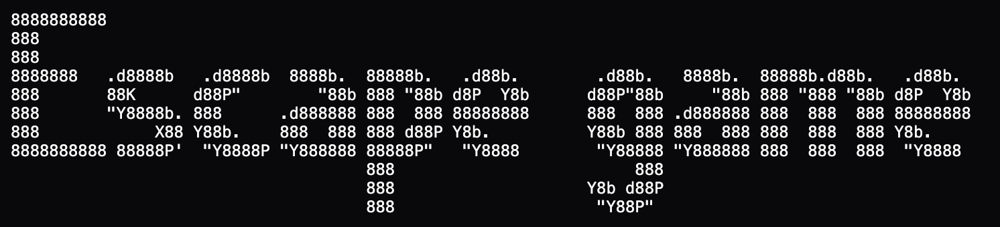

# CPT END OF YEAR TASK



## Instructions:

1. Unzip the download.
2. Open a Terminal and change into the game folder:

```bash
cd /path/to/CPT-END-OF-YEAR-TASK
```

3. Start the game with Python 3 (recommended):

```bash
python3 main.py
```

Note: On macOS you can also run the provided `run_game_mac.command` from Terminal with `sh run_game_mac.command` (no pre-approval required). Fullscreen behaviour is controlled by `AUTO_FULLSCREEN` in `config.py`. However, this feature is still experimental, so it is recommended to fullscreen, then apply calculations for maxmimum experience of the game.

## Download:
https://github.com/SadDiamonds/CPT-END-OF-YEAR-TASK/releases/latest

## Credits
- Lead Developer: SadDiamonds
- Tester: Isaac
- Tester & Balancer: David
